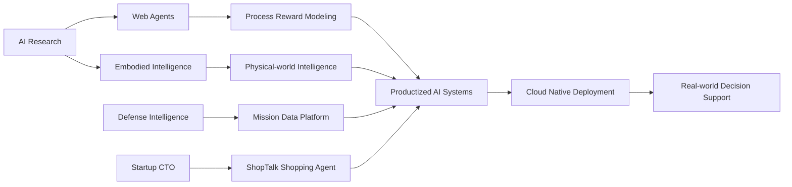

<!-- ============================================================= -->
<!--  GITHUB PROFILE README · STABLE VISUAL EDITION                -->
<!--  Design rule: no user-dependent stats cards to avoid errors.   -->
<!-- ============================================================= -->

 

  

  

<b>Research-driven builder working at the intersection of AI agents, mission-critical systems, and product engineering.</b> 
Defense Intelligence · Web Agents · LLM Systems · Startup Execution · Digital Twin / XR · Cloud Native Deployment

  

---

## 🧭 Operating Thesis

> **AI becomes meaningful when it is engineered into decisions, workflows, interfaces, and deployment pipelines.**

I build AI systems as end-to-end intelligence layers: data ingestion, model reasoning, agentic workflow, human-facing UX, cloud-native deployment, and operational feedback. My background connects **Yonsei AI research**, **Army AI Center defense intelligence projects**, **LLM/web-agent research**, and **startup CTO execution**.

---

## ⚡ Impact Dashboard

<table>
<tr>
<td width="25%" align="center" valign="top">
  
    
  <b>Army AI Center</b> 
  Korean Palantir-style intelligence platform, data fusion, operational analytics, decision support
</td>
<td width="25%" align="center" valign="top">
  
    
  <b>Paper Co-author</b> 
  Process Reward Models for reinforcing web agents
</td>
<td width="25%" align="center" valign="top">
  
    
  <b>Yonsei 예창패 1차 선정</b> 
  Shopping-agent platform, CTO, 7.5천만 원 투자유치
</td>
<td width="25%" align="center" valign="top">
  
    
  <b>Production AI Stack</b> 
  Docker, Kubernetes, AWS, FastAPI, Next.js, Supabase, MongoDB
</td>
</tr>
</table>

---

## 🧬 Identity Map

---

## 🛠 Technology Constellation

### AI / Research

 

  

### Product / Full Stack

 

  

### Cloud / DevOps / Spatial

 

---

## 🚀 Featured Work

<table>
<tr>
<td width="50%" valign="top">

### 🛡 Korean Palantir-style Defense AI Platform

Contributed to mission-critical AI systems for defense data fusion, analysis, visualization, and decision-support workflows at the Army AI Center.

**Focus**: Operational analytics · mission data platform · AI-assisted command support · intelligence workflows

</td>
<td width="50%" valign="top">

### 🐑 Web-Shepherd: PRMs for Web Agents

Co-author of **Web-Shepherd: Advancing PRMs for Reinforcing Web Agents**, a work on step-level process reward modeling for web navigation agents.

**Focus**: Web agents · PRM · trajectory evaluation · reward modeling · agent reinforcement

</td>
</tr>
<tr>
<td width="50%" valign="top">

### 🛍 ShopTalk — Shopping Agent Platform

Led technical architecture for a shopping-agent product that evolved from conversational commerce into an AI assistant for SME and consumer shopping workflows.

**Stack**: Next.js · TypeScript · Supabase · LangChain · RAG · multi-agent architecture · Vercel

</td>
<td width="50%" valign="top">

### 🧠 Embodied Intelligence Research

Researched the convergence of large language models, embodied agents, multimodal perception, and autonomous reinforcement learning for physical environments.

**Focus**: LLM-based agents · embodied reasoning · multi-modal perception · auto reinforcement learning

</td>
</tr>
</table>

---

## 🧩 Selected Project Portfolio

<table>
<tr>
<td width="33%" valign="top">

### 🚗 Traffic Incident AI
Computer vision system for objective accident analysis and fault estimation.

`YOLOv5` `OpenCV` `TensorFlow` `PyTorch` `RabbitMQ`

</td>
<td width="33%" valign="top">

### ❤️ Healthcare Intelligence Assistant
RAG-based assistant for cardiovascular monitoring and user-facing health workflows.

`GPT-4` `LangChain` `FastAPI` `MongoDB Atlas` `React Native`

</td>
<td width="33%" valign="top">

### 💧 Smart Water Management
AI-driven household water management with XR interaction layer.

`TensorFlow` `PyTorch` `AWS IoT` `Unity AR Foundation`

</td>
</tr>
<tr>
<td width="33%" valign="top">

### 📸 Snaps Analytics Platform
Creator analytics platform with cloud-native backend and scalable deployment.

`FastAPI` `MongoDB` `Docker` `Kubernetes` `AWS EKS`

</td>
<td width="33%" valign="top">

### 🏢 SpaceOptimizer
Modular space optimization and digital design platform.

`Flutter` `Firebase` `GCP` `Autodesk Forge API`

</td>
<td width="33%" valign="top">

### 🕺 Motion Capture System
Low-cost motion capture framework using drones and sensor networks.

`ROS` `OpenCV` `PCL` `Kalman Filters` `NVIDIA Jetson`

</td>
</tr>
</table>

---

## 🧠 Experience

<table>
<tr>
<td width="78" align="center" valign="top">
  
</td>
<td valign="top">

### Defense AI Developer · Army AI Center
Built and contributed to AI-assisted defense intelligence systems for data fusion, operational analytics, and mission decision support. Recognized with a **Chief of Staff commendation** for defense AI contributions.

</td>
</tr>
<tr>
<td width="78" align="center" valign="top">
  
</td>
<td valign="top">

### AI Researcher · LangAGILAB, Yonsei University
Conducted research on embodied intelligence, web agents, LLM-based agent systems, and autonomous reinforcement learning.

</td>
</tr>
<tr>
<td width="78" align="center" valign="top">
  
</td>
<td valign="top">

### CTO · ShopTalk
Led startup technical strategy, product architecture, and AI shopping-agent implementation. Selected in Yonsei University 예창패 1차 and raised **7.5천만 원** in investment.

</td>
</tr>
</table>

---

## 🏆 Recognition & Signals

  

---

## 📚 Research Highlight

<table>
<tr>
<td width="70%" valign="top">

### Web-Shepherd: Advancing PRMs for Reinforcing Web Agents

**Contribution area**: process reward modeling for web navigation agents.  
The work introduces a PRM-style evaluation approach for web-agent trajectories and connects reward modeling with practical web-agent reinforcement and inference-time decision support.

</td>
<td width="30%" align="center" valign="middle">

  

  

</td>
</tr>
</table>

---

## 🧪 Engineering Principles

<b>How I design AI products</b>

 

- Start from the **decision loop**, not only from the model.
- Convert research outputs into **usable workflows and interfaces**.
- Treat LLM agents as **systems**: retrieval, memory, tools, verification, observability, and feedback.
- Deploy with reliability: **Docker, Kubernetes, CI/CD, cloud-native architecture**.
- Optimize for real users, real latency, real cost, and real operational constraints.

<b>README stability notes</b>

 

This profile intentionally avoids user-dependent GitHub stat cards such as streak/stats/trophy widgets. Those services can break when the third-party API cannot resolve a user, hits rate limits, or changes upstream behavior. The design uses stable visual components instead: capsule-render, readme-typing-svg, shields.io badges, skillicons, Mermaid diagrams, HTML tables, and GitHub-native details blocks.

---

## 📫 Contact

  

<b>Open to research collaboration, AI product engineering, and mission-critical system development.</b>

  

